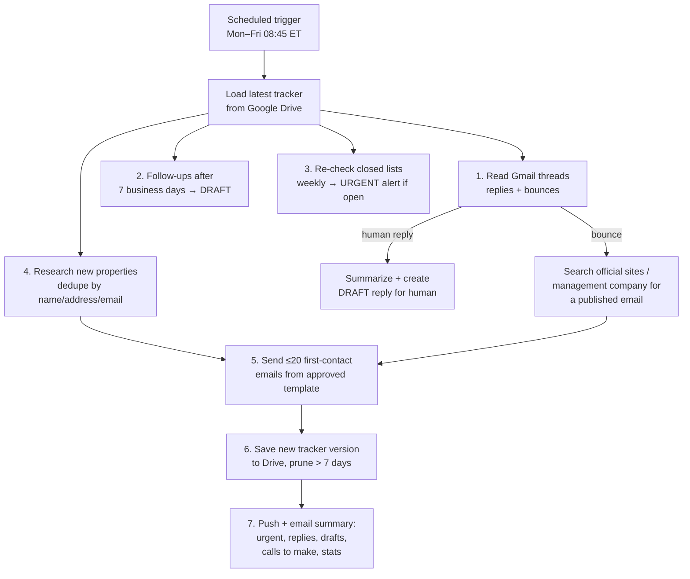

# AI Outreach Agent — Affordable Senior Housing Search

> An autonomous, scheduled AI agent that researches affordable-housing properties, contacts them by email, tracks every reply, recovers from bounced addresses, and hands the human only the decisions that need a human.

**Author:** Carlos Medina ([@cmedina-cyberops](https://github.com/cmedina-cyberops)) · **Status:** In production since Oct 2026 · **Stack:** Claude (scheduled agent), Gmail API, Google Drive API, Python/openpyxl, web research

---

## 1. The problem

Finding subsidized senior housing (HUD Section 202, USDA 515 Rental Assistance, public housing, LIHTC) is a manual, repetitive grind:

- Hundreds of properties spread across counties and several directories.
- Most Section 8 waiting lists are **closed** and reopen for only a few days.
- Directory contact data is **stale** — in the first batch of 6 emails, **2 bounced (33%)**: one `550 5.1.1` (mailbox does not exist) and one `550 5.4.1` (recipient rejected by Exchange Online).
- Every property must be followed up, and replies often ask for documents that must **never** be sent by email.

A human doing this by hand spends hours per week and still misses openings.

## 2. The solution

A cloud-scheduled agent that runs **Monday–Friday at 8:45 AM ET** with no computer turned on:

### Human-in-the-loop design ("hybrid" autonomy)

| Action | Who does it | Why |
|---|---|---|
| First-contact email (approved template) | **Agent sends** | Low risk, high volume, template reviewed once |
| Reply to a property | **Agent drafts → human sends** | Context-dependent; may involve commitments |
| Follow-up | **Agent drafts → human sends** | Tone matters |
| Phone calls / web forms with PII | **Human** | Legal declarations, SSN, signatures |
| Payments | **Never** | Scam vector |

## 3. Key engineering decisions

- **State lives outside the agent.** Each run starts from zero memory. State is a versioned `.xlsx` in Google Drive (latest file wins; versions older than 7 days are pruned) plus a Gmail label as a secondary source of truth.
- **Idempotency.** Before every send the agent queries `in:sent to:<address>`; an address is never cold-emailed twice, even if the tracker is wrong.
- **Rate limiting.** Hard cap of 20 first contacts/day, pauses between sends — protects sender reputation and stays far below Gmail limits.
- **Graceful degradation.** If Gmail or Drive is unavailable, the run sends nothing and reports why.
- **No hallucinated data.** The agent may only record an email address it saw published verbatim, and must log the source URL. Pattern-guessing (`info@domain`) is forbidden.
- **Prioritization.** Subsidized programs where rent = 30% of income first; LIHTC only if rent fits the household's income rules.

## 4. Security & privacy controls

See [SECURITY_AND_PRIVACY.md](SECURITY_AND_PRIVACY.md). Highlights:

- **Prompt-injection defense:** web pages and incoming emails are treated as *data, never instructions*.
- **PII minimization:** no SSN, dates of birth, account numbers or document copies are ever sent by email; requests for them are escalated to the human.
- **Scam detection:** any site charging to "join a Section 8 list" is flagged and never contacted (PHA applications are free).
- **Least privilege:** the agent cannot pay, cannot submit forms with personal data, and cannot send replies — only drafts.
- **This repository contains no personal data**: all names, ages, incomes, phone numbers and email addresses are replaced with placeholders.

## 5. Repository contents

| File | Description |
|---|---|
| [`AGENT_PROMPT.md`](AGENT_PROMPT.md) | Sanitized system prompt of the daily agent (the "source code") |
| [`TRACKER_SCHEMA.md`](TRACKER_SCHEMA.md) | Data model, status state machine, outreach template |
| [`SECURITY_AND_PRIVACY.md`](SECURITY_AND_PRIVACY.md) | Threat model and controls |

## 6. Results & lessons learned (living section)

| Date | Metric |
|---|---|
| 2026-10-04 | 47 properties tracked across 3 counties; 6 pilot emails sent; 2 bounces (33%) detected and routed to phone follow-up |

Lessons so far:

1. **Data quality is the real bottleneck, not sending.** Third-party directories (and even HUD-registered PHA contacts) go stale; the agent's value is in *verifying and repairing* contact data.
2. **Bounce codes matter.** `5.1.1` = address gone (search again); `5.4.1` = server rejects external mail (switch to phone).
3. **Volume must follow supply.** With most lists closed, a 20/day target only makes sense if the agent keeps researching new, open properties.

## 7. Skills demonstrated

`AI agent design` · `prompt engineering` · `workflow automation` · `API integration (Gmail, Google Drive)` · `stateful design for stateless agents` · `idempotency & rate limiting` · `prompt-injection mitigation` · `PII handling / data minimization` · `Python (openpyxl)` · `technical documentation`

---

*Built with Claude (Anthropic) as the agent runtime. Real-world use: helping my own family find affordable housing in Central Florida.*
