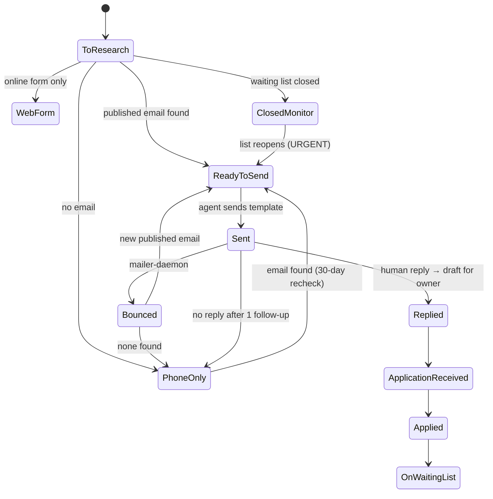

# Tracker Schema & Outreach Template

## Columns (`Tracker` sheet)

| Column | Purpose |
|---|---|
| ID | `<COUNTY>-<n>` stable identifier |
| Property, County, City, Type, Population | What and where (Type = Section 202, USDA 515, LIHTC, PHA, TBRA…) |
| Email, **Email source** | Contact + URL where it was published (auditability) |
| Phone, Website | Fallback channels |
| **Status** | State machine below |
| First contact date, **Gmail thread ID**, Last contact | Link between spreadsheet and mailbox |
| # Follow-ups | Caps follow-ups at 1 |
| Reply summary, Next step (for owner), Notes | Human-readable context |
| Added by, Date added | Initial research vs. daily agent |
| Last web check | Added dynamically for closed-list monitoring |

## Status state machine



## First-contact template (approved once by the owner)

```text
Subject: Waiting list inquiry – [Property] – senior couple

Hello,

My name is {OWNER_NAME}. I am writing on behalf of my parents, a senior couple, who currently
live in {CITY}, FL and are looking for affordable housing. They are interested in [Property] and
plan to move within the next {MOVE_WINDOW}. [One property-specific sentence.]

Their household is 2 people with a very low annual income (below 30% of the area median income).

Could you please let me know:
1. Is your waiting list currently open, and approximately how long is the wait?
2. Are any 1- or 2-bedroom units available now or soon, and what are the current rents
   (or is rent based on 30% of income)?
3. How do we apply (online, by email as PDF, or in person), and is there an application fee?
4. What documents should they prepare?

They speak Spanish, and I am happy to assist with communication.

Best regards,
{OWNER_NAME} · {PHONE} · {EMAIL}
```
